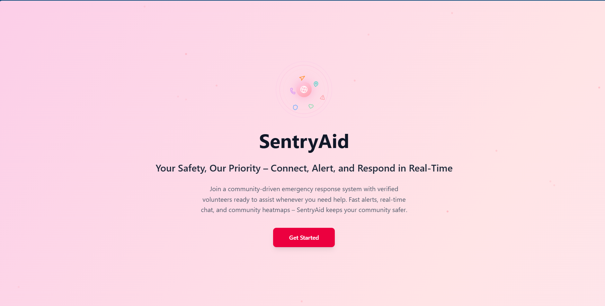
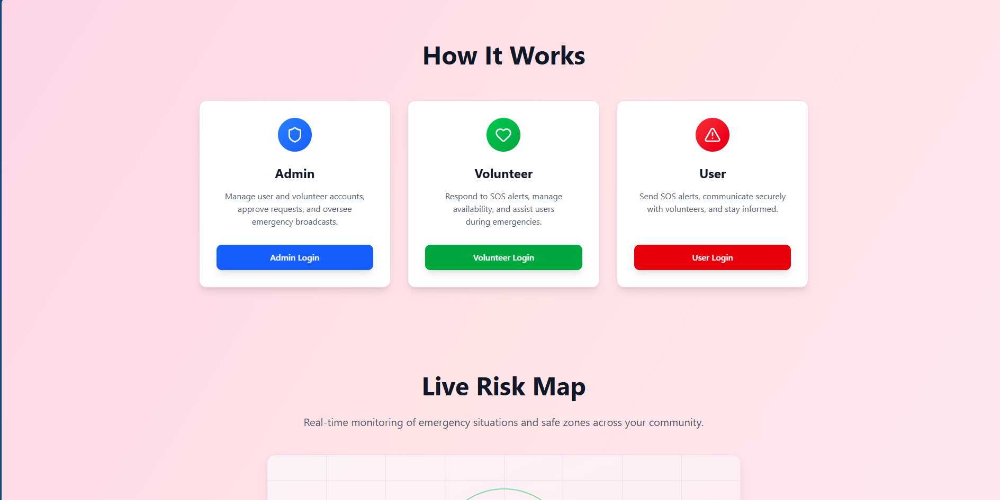
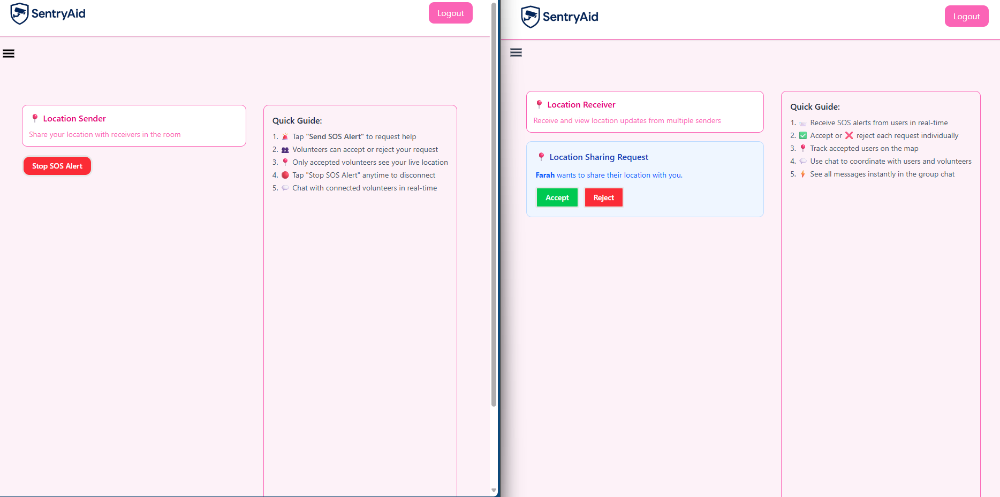
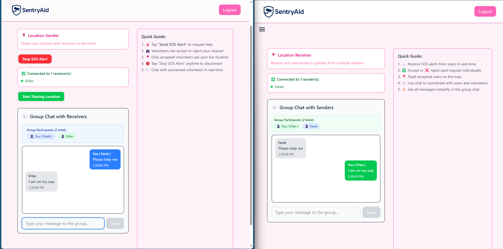
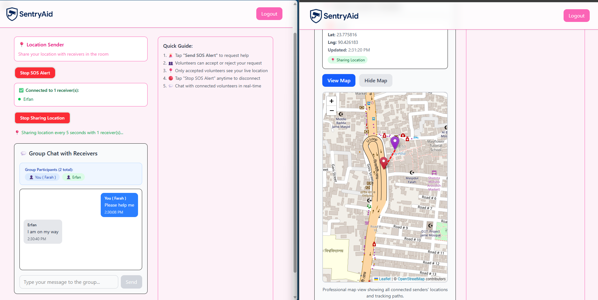

# SentryAid 🛡️  

**SentryAid** is a women-focused safety and empowerment platform built with the **MERN stack**.  
It allows women to **send SOS alerts**, receive **real-time notifications**, and **report volunteers** for misconduct.  
Admins can broadcast urgent updates, manage reports, and oversee volunteer activity — creating a **secure support ecosystem** for women in emergencies.  

🔗 **Live Demo:** [Click Here](https://sentryaid-frontend.onrender.com)  

---

## 🛠️ Tech Stack  
| Layer         | Technology |
|---------------|------------|
| Frontend      | React + Vite, TailwindCSS |
| Backend       | Node.js, Express.js |
| Database      | MongoDB + Mongoose |
| Real-Time     | Socket.IO (for live notifications, optional) |
| Deployment    | Render (Backend), Vercel/Netlify (Frontend) |
| Other         | Axios, CORS, JavaScript (ES6) |

---


## 👥 Contributors  
- **Farah Tabussum** – [GitHub](https://github.com/FarahTabussum)
- **Rubaiyat Haque** – [GitHub](https://github.com/Rubi1018) 
- **Abrar Ibne Haque** – [GitHub](https://github.com/BaraYaga)


---

## ⚡ Features  

### 👩 User Features  
- Register and maintain **personal profile** (with medical info, blood group, allergies, etc.)  
- Trigger **SOS alerts** with one click in emergencies  
- View **real-time notifications** from admins  
- Submit and track **reports against volunteers**  

### 👨‍💼 Admin Features  
- Approve or manage **volunteers and users**  
- Broadcast **notifications** to all users instantly  
- View, review, and update **report statuses** (`under_review`, `resolved`, `dismissed`)  
- Monitor **emergency SOS alerts**  

### 🙋 Volunteer Features  
- View **assigned notifications**  
- Respond to **SOS requests**  
- Maintain **basic volunteer info**  

---

## 🧑‍💻 How It Works  

1. **User Onboarding**  
   - User registers and logs in  
   - Personal info stored securely in MongoDB  

2. **SOS Flow**  
   - User presses **SOS button**  
   - Alert is sent to backend → stored + forwarded to admin/volunteers  
   - Admin/volunteers are notified instantly  

3. **Notifications**  
   - Admin creates a **bulletin message**  
   - Message appears in all connected users’ dashboards  

4. **Reports System**  
   - User files a complaint against a volunteer  
   - Admin reviews and updates the report’s status  
   - User sees the progress in their dashboard  

---

## 📸 Screenshots  

### 1️⃣ Website Homepage  
<table>
  <tr>
    <td></td>
    <td></td>
  </tr>
</table>  

### 2️⃣ User & Volunteer SOS  
<table>
  <tr>
    <td></td>
    <td></td>
  </tr>
  <tr>
    <td style="text-align:center;"></td>
  </tr>
</table>  

---

## 💻 Setup & Instructions  

1. **Clone the repository**  
   ```bash
   git clone https://github.com/Erfan-Khan-Dhrubo/SentryAid.git
   cd SentryAid
   ```

2. **Backend setup**  
   Open a terminal and run:  
   ```bash
   cd backend
   npm install
   npm run dev
   ```

3. **Frontend setup**  
   Open another terminal and run:  
   ```bash
   cd frontend
   npm install
   npm run dev
   ```
